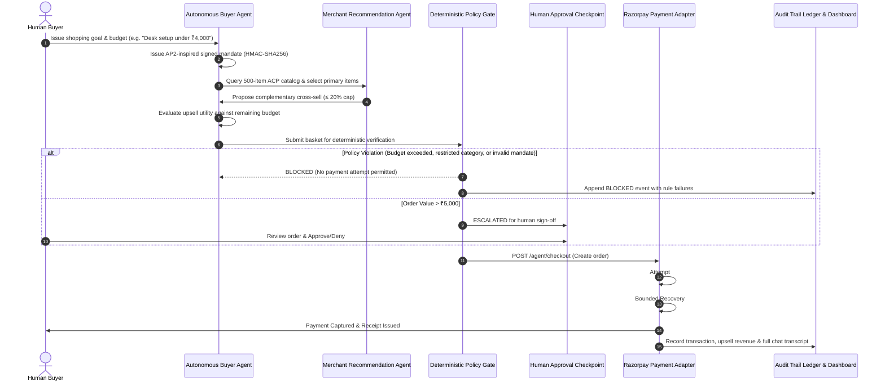

# ⚡ Verve & Co. — Agentic Commerce & Checkout Engine

<div align="center">


<br/>

**An autonomous, bounded, and auditable agentic commerce system where AI buyers and merchant agents collaborate within strict deterministic guardrails.**

[Live Prototype Overview](#-architecture--transaction-flow) • [Quick Start](#-quick-start-guide) • [Vercel Deployment](#-deploying-to-vercel) • [Inspection & Auditing](#-interactive-inspection--audit-features) • [Endpoints Reference](#-acp-adapter--api-endpoints)

</div>

---

## 🎯 Executive Summary for Judges & Evaluators

**Verve & Co.** is built for **Track 01: AI Growth & Agentic Commerce** in the Razorpay AI Buildathon. It delivers on Razorpay's high-bar criteria: every financial action is **explainable, bounded, gated, and auditable**, featuring **deliberate payment decline with one bounded recovery** and **real merchant revenue attribution**.

### 🌟 Key Scorecard & Feature Highlights

| Buildathon Evaluator Criteria | How Verve & Co. Delivers It |
|---|---|
| **AI Growth & Merchant Revenue** | Context-aware merchant agent proposes relevant complementary cross-sells within a configurable policy budget cap (10%, 15%, 20%, 25%). Realized incremental revenue is tracked in real-time. |
| **Agentic Buyability (ACP-Compatible)** | Exposes machine-readable discovery (`/.well-known/acp/config.json`) and checkout adapters (`/acp/catalog`, `/acp/checkout-sessions`), enabling external AI buyers to discover and purchase programmatically. |
| **AP2-Inspired Buyer Mandate** | Implements cryptographically verifiable, signed Buyer Authorization Mandates (HMAC-SHA256) binding the agent to an authorized spend cap, expiry, and allowed merchant categories. |
| **Deterministic Policy Gate** | Pre-flight policy gate strictly precedes order creation. Validates buyer budget, merchant hard cap (₹6,000), 9 allowed categories (barring restricted safety categories like `kids`), and mandate validity. |
| **Human-in-the-Loop Escalation** | Orders exceeding ₹5,000 automatically pause and escalate to an interactive **Human Approval Checkpoint** before any payment capture can proceed. |
| **Deliberate Failure & Bounded Auto-Recovery** | Simulates a realistic payment decline on the primary instrument followed by **exactly one bounded recovery retry** using a backup test card, successfully completing the capture. |
| **Dual-Surface Architecture** | **Surface 1:** Verve & Co. Storefront & Agentic Checkout Console.<br/>**Surface 2:** "My Agent" Oversight Dashboard with real-time spending KPIs, category breakdown, mandate utilization, and behavioral Trust Score (0–100). |
| **Interactive Decision Timeline & Inspector** | Every decision in the chronological timeline is clickable, opening a **Full AI Chat & Decision Audit Modal** with complete prompt/reasoning transcripts, timestamps, and policy gate rule checks. |
| **Exportable Audit Logs** | Comprehensive CSV and JSON export options with time filters (*Since Last Reset*, *Weekly*, *Monthly*, *Yearly*). |
| **500-Item Domain-Rich Catalog** | Full 500-product curated catalog (`shared/catalog.json`) across 9 retail categories, featuring instant search, filtering, and responsive load-more capabilities. |

---

## 🏗 Architecture & Transaction Flow



---

## 🗂 Project Structure

```text
├── agentic-checkout-demo.jsx     # Full-featured React Console & "My Agent" Dashboard
├── razorpay-agent-server.js      # Canonical Express backend, Policy Gate & Razorpay SDK
├── api/
│   └── index.js                  # Vercel Serverless Function entry point
├── shared/
│   ├── catalog.json              # Curated 500-item catalog + 5 canonical upsells
│   ├── policy.json               # Deterministic merchant policy thresholds
│   └── mandate.js                # AP2-inspired mandate signing & verification
├── src/
│   ├── main.jsx                  # Vite React root mount
│   └── index.css                 # Glassmorphic CSS tokens & typography
├── test-server-endpoints.js      # Automated backend validation suite (9/9 pass)
├── vercel.json                   # Vercel routing, CORS & serverless rewrites
├── vite.config.js                # Vite configuration with local API proxy
├── package.json                  # Dependencies and execution scripts
└── .env.example                  # Environment configuration template
```

---

## 🚀 Quick Start Guide

### Prerequisites
- [Node.js](https://nodejs.org/) (v18 or higher recommended)
- `npm` or `yarn`

### 1. Clone & Install Dependencies
```bash
git clone https://github.com/taneshkhandal07-debug/Verve-Co.git
cd Verve-Co
npm install
```

### 2. Configure Environment (Optional)
Copy `.env.example` to `.env`:
```bash
cp .env.example .env
```
*(The application runs out-of-the-box with intelligent simulated fallbacks if API keys are left unset.)*

### 3. Start Development Servers

You can run both the frontend and backend simultaneously:

**Terminal 1 — Start the Backend API & ACP Adapter:**
```bash
npm run server
# Runs on http://localhost:4000
```

**Terminal 2 — Start the Vite Frontend:**
```bash
npm run dev
# Runs on http://localhost:3000
```

Visit **`http://localhost:3000`** in your browser to interact with the full agentic commerce console.

### 4. Run Automated Test Suite
To verify the deterministic policy gate, ACP feeds, mandate signatures, and payment recovery:
```bash
node test-server-endpoints.js
```
*(Output: 9/9 tests pass with 100% compliance).*

---

## ☁️ Deploying to Vercel

Verve & Co. is structured for zero-configuration, seamless deployment on **Vercel** with full static frontend hosting and Node.js serverless functions.

### One-Click / CLI Deployment

1. Install the Vercel CLI (or link via the Vercel Web Dashboard):
   ```bash
   npm i -g vercel
   vercel
   ```
2. Set Environment Variables in your Vercel Project Dashboard (under **Settings > Environment Variables**):
   - `RAZORPAY_KEY_ID`: *(Your Razorpay Test Key)*
   - `RAZORPAY_KEY_SECRET`: *(Your Razorpay Test Secret)*
   - `RAZORPAY_WEBHOOK_SECRET`: *(Optional webhook secret)*
   - `ACP_API_TOKEN`: `verve_acp_demo_bearer_token` *(or custom bearer token)*

3. **Vercel Routing Behavior:**
   - Static assets & React UI are served from `dist/` (via `npm run build`).
   - All machine-readable discovery and transaction routes (`/acp/*`, `/.well-known/*`, `/agent/*`, `/audit-log`) are routed automatically to `api/index.js` via `vercel.json`.

---

## 🔍 Interactive Inspection & Audit Features

### 1. Clickable Chronological Decision Timeline
Navigate to the **"My Agent" Dashboard** surface. Every card in the decision timeline is clickable:
- Clicking any event opens the **Decision & Chat Audit Inspector Modal**.
- Displays the complete multi-turn dialogue between the Buyer Agent and Merchant Agent.
- Shows timestamp, transaction ID, mandate reference, and policy gate compliance.
- Includes a 1-click **"Copy Transcript"** button for audit logs.

### 2. Multi-Format History Log Downloads
Export compliance logs at any time from the dashboard:
- **Export Formats:** `JSON` (raw structured telemetry) or `CSV` (formatted tabular spreadsheet).
- **Time Filters:** *Since Last Reset*, *Past Week*, *Past Month*, or *Past Year*.

### 3. Behavioral Trust Score (0–100)
A dynamic, 5-pillar mathematical model quantifying agent safety:
- **Pillar 1: Budget Adherence** (Weight: 25%)
- **Pillar 2: Policy Compliance** (Weight: 25%)
- **Pillar 3: Mandate Integrity** (Weight: 20%)
- **Pillar 4: Recovery Success** (Weight: 15%)
- **Pillar 5: Goal Fidelity** (Weight: 15%)

---

## 📡 ACP Adapter & API Endpoints

| Method | Endpoint | Description | Auth Required |
|---|---|---|---|
| `GET` | `/.well-known/acp/config.json` | Machine-readable ACP capability discovery | No |
| `GET` | `/acp/catalog` | ACP catalog feed (filterable by `category` and `search`) | Bearer Token |
| `POST` | `/acp/checkout-sessions` | Create a programmatic checkout session with mandate | Bearer Token |
| `GET` | `/acp/checkout-sessions/:id` | Query state of an ACP checkout session | Bearer Token |
| `POST` | `/acp/checkout-sessions/:id/complete` | Complete ACP session (requires `Idempotency-Key`) | Bearer Token |
| `POST` | `/agent/checkout` | Main policy-gated checkout endpoint | No (Demo) |
| `POST` | `/agent/escalate` | Human-in-the-loop approval resolution | No (Demo) |
| `POST` | `/webhook/razorpay` | Razorpay webhook signature verification | X-Razorpay-Signature |
| `GET` | `/audit-log` | Full tamper-evident server audit ledger | No |

---

## 🧪 Preset Evaluator Scenarios

Use the interactive scenario buttons in the console to evaluate edge cases immediately:

1. **Desk Setup Upgrade (Multi-item + Complementary Cross-sell):**
   - Buyer picks Ergonomic Mesh Chair (`p1`) and LED Desk Lamp (`p3`).
   - Merchant agent identifies office category and recommends Felt Desk Mat (`p5`).
   - Upsell accepted within budget; policy passes; payment captured.
2. **Weekend Coffee Routine (Kitchen & Pantry):**
   - Buyer selects French Press Coffee Maker (`p6`).
   - Merchant recommends Artisanal Whole Bean Coffee (`p7`).
   - Demonstrates category-relevant complementary bundling.
3. **Executive Travel Kit (High-Value Human Escalation > ₹5,000):**
   - Cart subtotal exceeds the ₹5,000 threshold.
   - Automatically pauses at the **Human Approval Checkpoint**.
   - Review modal allows evaluator to click **Approve** or **Deny**.
4. **Restricted Category Block (Safety Rule Test):**
   - Attempting to purchase items from restricted categories (`kids`) triggers an immediate **POLICY GATE: BLOCKED** decision with zero fund exposure.
5. **Deliberate Failure & Bounded Recovery:**
   - Primary test card triggers `test_card_declined`.
   - Agent triggers single bounded recovery retry with backup card, capturing payment safely.

---

## 🛡️ Trust, Security & Deterministic Boundaries

- **Price Authority:** The server never trusts client-submitted totals or prices. Cart values are calculated strictly from the server-side catalog.
- **Tamper Evidence:** Buyer mandates are cryptographically signed and verified prior to any authorization.
- **Idempotency:** Completion requests require unique UUID idempotency keys to prevent double-charging.
- **Zero Hallucinated Spends:** Policy gates run deterministically in code, ensuring LLMs cannot bypass budget or category constraints.

---

## 👥 Authors & Buildathon Track
- **Project:** Verve & Co. — Agentic Commerce & Checkout Engine
- **Track:** Track 01 — AI Growth & Agentic Commerce
- **Target Event:** Razorpay AI Buildathon
- **Repository:** [https://github.com/taneshkhandal07-debug/Verve-Co](https://github.com/taneshkhandal07-debug/Verve-Co)
